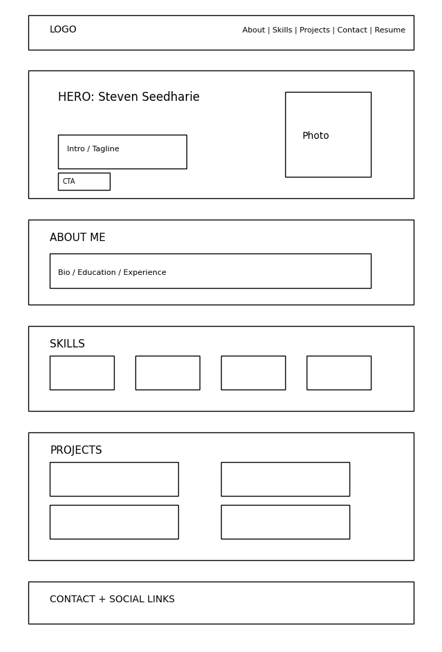

Steven Seedharie Portfolio Website

Project Overview
This is my personal portfolio website that I built for my web design class. I made it to show who I am, what I know, and what I've worked on. It's hosted on GitHub Pages and has sections for my bio, skills, projects, and a contact form.

PART 1: CONTENT

1. What is your full name as you want it displayed professionally?
Steven Seedharie

2. What is the purpose of your portfolio website?
The purpose is to have a place online where people can learn about me my background, skills, and work. Mostly aimed at classmates and anyone who might want to hire me down the line.

3. Who is the target audience?
Mainly peers, classmates, and professors. Also future employers in CS.

4. What skills do you want to highlight?
Python, Java, C++, HTML/CSS, SQL, MIPS Assembly, data structures, algorithms, Git, GitHub, and Excel for data analysis.

5. What projects or work will you showcase?
Projects from my coursework. linked list algorithms, graph algorithms, SQL databases, MIPS assembly programs, Python scripts, C++ programs, and this portfolio site itself.

6. How will you describe yourself in a short professional bio?
I'm a CS student from Queens, NY. Youngest child of Guyanese immigrants. I play basketball, trade NQ futures, and work at Gap Inc. I'm goofy and caring and I always show up for people.

7. What pages will your site include?
Home, About, Skills, Projects, Contact, and a Design Document section. All on one page you can scroll through.

8. What is your career goal or desired role?
I'm open to anything in CS right now. Still figuring out if I want to go into software engineering, data, or something else. Just trying to keep all options open.

9. What technologies or tools do you have experience with?
Python, Java, C++, HTML, CSS, SQL, MIPS Assembly, JavaScript, Excel, Visual Studio

10. What achievements or experiences are worth highlighting?
B.S. CS at CUNY Queens College (still going), A.S. CIS from Queensborough CC, working at Gap Inc. since 2022, mentored kids through NYC DYCD back in 2018 and 2019, and I trade stocks and NQ futures on the side.

11. What call to action should visitors take?
Reach out through the contact form, connect on LinkedIn or GitHub, or download my resume.

12. Will you include a resume? In what format?
Yes, as a downloadable PDF linked in the nav bar and the About section.

13. What social or professional links will you include?
GitHub and LinkedIn.

PART 2: DESIGN

1. What overall style will best represent you?
I went with a magazine style layout bold text, asymmetric sections, editorial feel. Wanted it to stand out and not look like every other basic portfolio.

2. What color scheme will you use and why?
Teal and orange. Teal for labels and accents, orange for names and highlights. I picked it because it's bold and different from the typical combo everyone uses.

3. What fonts will you use for headings and body text?
Headings use Playfair Display, big bold italic serif that looks editorial. Body text is DM Sans which is clean and easy to read. Labels and nav links use Space Mono which is monospace and gives it a techy feel.

4. How will your design reflect your personality or field?
The bold fonts and asymmetric layout reflects that I have my own style. The monospace labels and teal color give it a CS vibe without being boring.

5. What layout will your homepage follow?
Split screen hero, my name and text on the left, graduation photo filling the right side. Then the rest of the sections stack below.

6. How will you organize project sections visually?
Card grid layout. First card is wider than the rest to break up the symmetry. Each card has a title, description, and tech tags.

7. Will the site be mobile-friendly? How will you ensure responsiveness?
Yes. I used CSS Flexbox and media queries. On mobile the photo panel hides and the nav turns into a hamburger menu.

8. What visual hierarchy will guide visitors?
Big name at the top, then section labels, then headings, then body text. Orange highlights draw attention to the important stuff.

9. How will consistency be maintained across pages?
All sections use the same CSS variables for colors and fonts so everything stays consistent.

10. How will accessibility be considered?
I made sure the contrast is high enough to read easily, kept font size at 16px minimum, used proper HTML tags like nav and section, added alt text to images, and made sure you can tab through interactive elements.

11. Will you use icons, images, or illustrations? Why?
Yes Font Awesome icons for skills and social links. Also added my graduation photo in the hero and small inline images in the About section to make it feel personal.

12. What portfolio websites inspired your design?
I looked at a few portfolio sites online to get ideas for layout and style before designing my own.

 PART 3: INTERACTIVITY

1. What interactive elements will your site include?
Sticky nav with smooth scroll, hamburger menu on mobile, hover effects on cards and buttons, a contact form, resume download, copy email button, back to top button, and a dark/light mode toggle.

2. Will your site include a contact form? How will it work?
Yes. It has fields for name, email, and message. JavaScript checks that everything is filled in correctly before it sends. It uses Formspree to actually deliver the message to my email without needing a backend.

3. What JavaScript features will you implement?
Smooth scrolling, hamburger menu toggle, fade-in animations using Intersection Observer, form validation, active nav highlighting, copy email to clipboard, back to top button, and dark mode toggle that saves your preference with localStorage.

4. How will users receive feedback from interactions?
Cards and buttons glow on hover, the form shows error messages if something is wrong, a success message pops up after sending, "Copied!" shows when you copy the email, and the active nav link gets underlined.

5. How does interactivity improve the user experience?
It makes the site feel alive instead of just a static page. The animations make it smooth, the form feedback makes it clear, and things like the copy button and dark mode just make it easier to use.

Target Audience
Peers, classmates, professors, and future employers in CS.

Content Strategy
I focused on making it personal and showing who I actually am — not just a list of skills. The bio tells my story and the projects show what I've learned in class.

 Information Organization
Home -> About -> Skills -> Projects -> Contact -> Design Document

Visual Design
Style: Magazine editorial
Colors: Teal (#00897B) and orange (#F4511E)
Fonts: Playfair Display, DM Sans, Space Mono
Dark mode:Toggle switch at bottom right of screen

Wireframe:

#Interaction / Functionality
Smooth scroll, hamburger menu, contact form with Formspree, fade-in animations, dark mode toggle, back to top button, copy email button.

 Technical Overview
HTML5, CSS3, Vanilla JavaScript
No frameworks just Font Awesome for icons
Hosted on GitHub Pages

Timeline
day 1 Planned the content and answered design questions
day 4 Built the HTML structure and CSS styling 
day 7 Added JavaScript features 
day 10 Tested everything and deployed to GitHub Pages

External Resources
Google Fonts   https://fonts.google.com
Font Awesome   https://fontawesome.com
Formspree   https://formspree.io
GitHub Pages Docs    https://docs.github.com/en/pages
MDN Web Docs   https://developer.mozilla.org
Portfolio reference   https://brittanychiang.com
